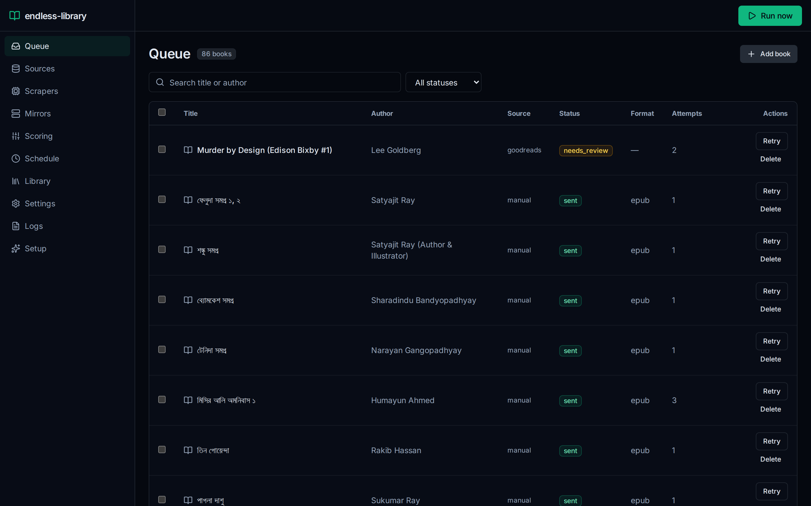
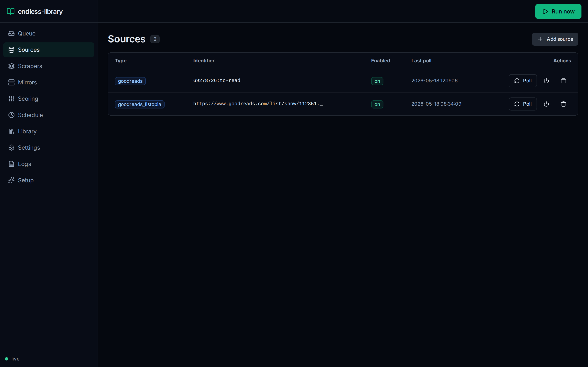
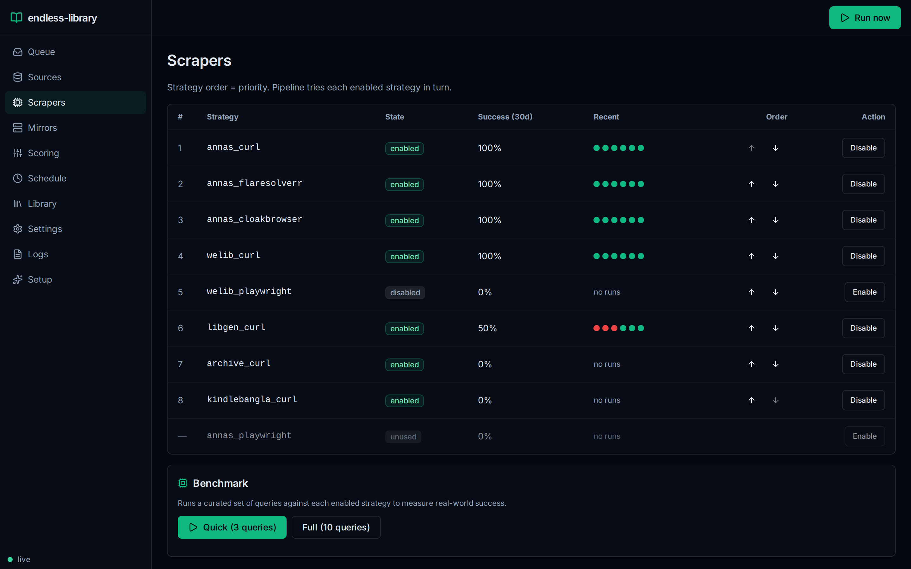
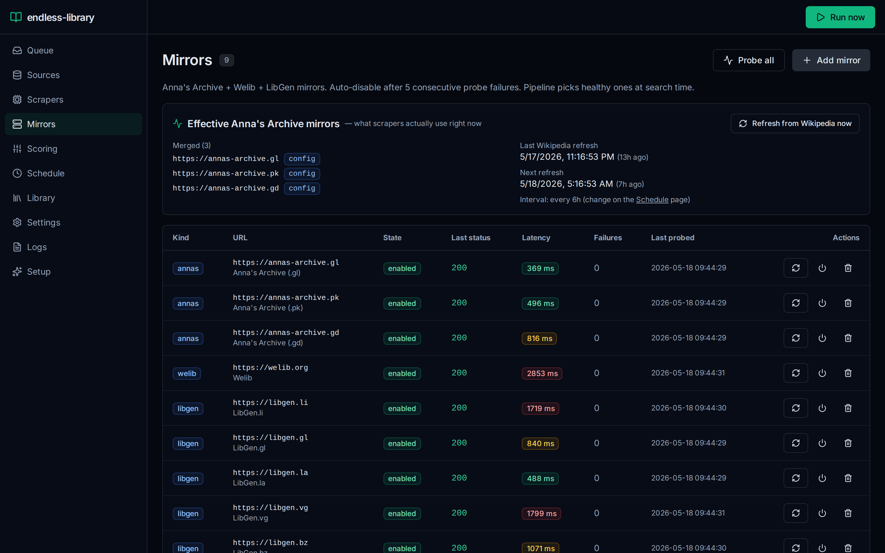
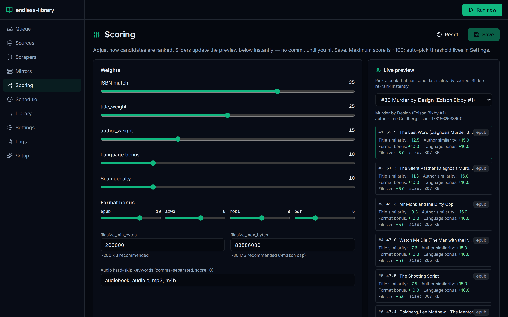
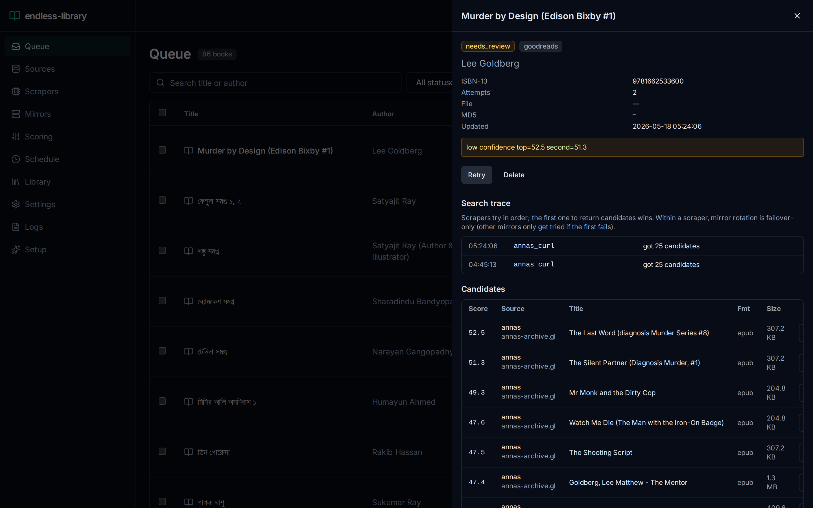

# biblichor

[](https://www.python.org/)
[](https://vuejs.org/)
[](https://fastapi.tiangolo.com/)
[]()
[](LICENSE)

Self-hosted automation that watches your reading lists, finds the books on Anna's Archive (with Welib, LibGen, archive.org, and KindleBangla fallbacks), converts them where needed, and emails them to your Kindle — with a Vue 3 dashboard, an integrated BookOrbit library (reader + Kobo sync + OPDS), and a scheduler you control from the browser.

> The Python package is named `endless_library` internally; the project / repo is `biblichor`. Both names refer to the same thing.



---

## What it does

```
┌──────────────────┐    ┌──────────────────┐    ┌──────────────────┐
│  Goodreads RSS   │    │   Hardcover      │    │  Manual / Listopia│
│  Listopia/Series │    │   GraphQL        │    │  / Series source  │
└────────┬─────────┘    └─────────┬────────┘    └─────────┬────────┘
         │                        │                       │
         └────────────┬───────────┴───────────┬───────────┘
                     ▼                        ▼
              ┌──────────────────────────────────────┐
              │   Source poll jobs (one per source)  │
              │   APScheduler, intervals per source  │
              └────────────────┬─────────────────────┘
                               ▼
                      ┌────────────────────┐
                      │   books queue (SQLite WAL)
                      │   states: new → queued → searching →
                      │   needs_review | downloaded → converted →
                      │   sent | failed | skipped
                      └────────┬───────────┘
                               ▼
      ┌────────────────────────────────────────────────────────────┐
      │ scraper strategies, bench-ranked + fallback chain          │
      │                                                            │
      │  Anna's Archive:                                           │
      │   1. annas_curl           — curl-cffi (Chrome120 TLS impersonation)
      │   2. annas_flaresolverr   — Cloudflare challenge solver
      │   3. annas_cloakbrowser   — stealth headless Chromium     │
      │   4. annas_playwright     — vanilla Playwright (last resort)
      │                                                            │
      │  Welib (CF Turnstile-gated):                               │
      │   5. welib_curl + IPFS gateway iteration (40+ gateways)    │
      │   6. welib_playwright (auth-cookie injection optional)     │
      │                                                            │
      │  LibGen mirrors (libgen.li/.is/.rs/.st):                   │
      │   7. libgen_curl + IPFS fallback                           │
      └────────────────────────────┬───────────────────────────────┘
                                   ▼
                ┌──────────────────────────────────────┐
                │ score candidates                     │
                │  ISBN match (35) + title rapidfuzz   │
                │  + author rapidfuzz + format bonus   │
                │  + language bonus + filesize sanity  │
                │  − scan penalty − derivative skip    │
                └──────────────┬───────────────────────┘
                               ▼
                ┌──────────────────────────────────────┐
                │ auto-pick if score ≥ threshold       │
                │ OR (score ≥ threshold + bonus and no │
                │  gap requirement) → needs_review     │
                └──────────────┬───────────────────────┘
                               ▼
       ┌─────────────────────────────────────────────────────┐
       │ download (streaming + MD5 verify + .part resume)    │
       │      → convert (Calibre `ebook-convert` if needed)  │
       │      → enrich metadata (`ebook-meta` author/series/ │
       │         tags/ISBN) — Kindle uses these for collections
       │      → email to Kindle (aiosmtplib + STARTTLS)      │
       └─────────────────────────────────────────────────────┘
                               ▼
                         ┌───────────┐
                         │  Kindle   │
                         └───────────┘

      ┌──────────────────────────────────────────────────────┐
      │  Dashboard (FastAPI + Vue 3 SPA, Tailscale-friendly) │
      │  /queue       Books queue + bulk delete + retries    │
      │  /sources     Add/edit Goodreads (shelf, Listopia,   │
      │               series), Hardcover, manual             │
      │  /scrapers    Toggle strategies + see bench history  │
      │  /mirrors     Curated mirror health table            │
      │  /scoring     Live-edit scoring weights              │
      │  /schedule    Pause/resume/run/reschedule any job    │
      │  /settings    SMTP, Pushover, Kindle, polling tuning │
      │  /logs        Recent events stream (WebSocket)       │
      │  /lib         Library page → BookOrbit (separate    │
      │               container @ BOOKORBIT_URL; serves      │
      │               reader, Kobo sync, KOReader, OPDS)     │
      └──────────────────────────────────────────────────────┘
```

## Features

| Capability | Details |
|---|---|
| **Reading-list sources** | Goodreads RSS shelves, Goodreads Listopia, Goodreads series (main-series filter), Hardcover GraphQL, manual entries |
| **Anna's Archive client** | curl-cffi Chrome120 impersonation, FlareSolverr session warm-up, fast-fail on 403/429/503, CDN URL resolution from `/slow_download/` |
| **Anti-Cloudflare** | FlareSolverr session lifecycle, optional stealth headless Chromium via CloakBrowser, Playwright fallback |
| **Welib fallback** | `/auto_download`, `/slow_download`, IPFS gateway iteration over 40+ gateways with HEAD-verify |
| **LibGen fallback** | Column-positional table parsing across libgen.li/.is/.rs/.st with IPFS via `/ads.php?md5=` |
| **Auto mirror discovery** | 6-hour background job scrapes Anna's Wikipedia infobox; new mirrors flow into config automatically without losing the hardcoded baseline |
| **Format handling** | EPUB native, AZW3/MOBI/PDF converted via Calibre `ebook-convert`, sized-checked against `attachment_max_mb` before SMTP |
| **Metadata enrichment** | Calibre `ebook-meta` writes author, series, tags, ISBN into the file before Kindle send so it shows up in collections |
| **Library integration** | Files dropped into BookOrbit's watched directory; BookOrbit ingests via embedded metadata. Linked from the dashboard's Library page. `ebook-convert` + `ebook-meta` from Calibre stay as CLI tools for format conversion + metadata writing. |
| **Kindle email send** | `aiosmtplib` with STARTTLS, app-password support (Gmail), per-attachment size guard |
| **Scoring** | ISBN match (35) + title rapidfuzz + author rapidfuzz + format bonus + language bonus + filesize sanity + scan penalty + derivative-content (summary/conversation-starters/study-guide) hard-skip |
| **Resume** | Stage timestamps (`downloaded_at`, `converted_at`, `sent_at`) — resuming picks up at the highest completed stage |
| **Scheduler** | APScheduler inside the FastAPI process: per-source poll jobs, queue process, retry-failed, daily summary, mirrors refresh. Pause/run-now/reschedule from the browser, persisted to config.yaml + DB |
| **Bench** | Curated query set in `bench/queries.yaml`; CLI subcommand runs each strategy against each query, ranks by latency + success rate |
| **Notifications** | Pushover per-event (book sent / needs review / failure) and daily summary |
| **Storage** | SQLite WAL; 7 tables (books, candidates, events, source_accounts, bench_runs, mirrors, sources); idempotent ALTER migrations |
| **Dashboard** | Vue 3 + Tailwind + shadcn-vue + Pinia + Vue Router + Lucide icons + WebSocket event stream |
| **Deployment** | Native via systemd unit + uvicorn; FlareSolverr + BookOrbit + Postgres in Docker via compose |

## Screenshots

<table>
  <tr>
    <td width="50%"><b>Queue</b><br></td>
    <td width="50%"><b>Sources</b><br></td>
  </tr>
  <tr>
    <td><b>Scrapers</b><br></td>
    <td><b>Mirrors (with bench)</b><br></td>
  </tr>
  <tr>
    <td><b>Scoring config</b><br></td>
    <td><b>Book detail (search trace + candidates)</b><br></td>
  </tr>
</table>

## Prerequisites

| Component | Why | Notes |
|---|---|---|
| **Python 3.12** | Backend runtime | Tested on 3.12 only |
| **Node.js 20+** | Build the Vue 3 SPA | Built once at install time; not needed at runtime |
| **Calibre** | `ebook-convert`, `ebook-meta` (CLI tools only — Calibre-Web is no longer used) | Install via apt: `sudo apt-get install -y calibre` |
| **Docker + docker compose** | FlareSolverr + BookOrbit + Postgres | Required for the easy-setup path |
| **An SMTP account** | Send to Kindle | Gmail with an app password is the easy path |
| **Amazon Kindle email setup** | Whitelist sender, capture `@kindle.com` address | <https://www.amazon.com/sendtokindle> |
| **Optional: Tailscale** | Private dashboard exposure | Bind the dashboard to your Tailscale IP via `TAILSCALE_IP=` |
| **Optional: Pushover** | Push notifications | Free user key + create a free app token |

## Setup from scratch

### The easy way — Docker Compose (recommended)

One command, ~5 minutes, works on Linux / macOS / Windows (via WSL2):

```bash
git clone https://github.com/SutanuNandigrami/biblichor.git
cd biblichor
./deploy/bootstrap.sh
```

`bootstrap.sh` walks you through every secret in one go:

  - Gmail account + **App Password** (the SMTP-to-Kindle path)
  - Your `@kindle.com` send-to-kindle address
  - **BookOrbit admin** user / email / display name / password
  - Optional: ports, TZ, ClamAV opt-in

It then writes a single `.env`, pulls + builds the services
(biblichor + FlareSolverr + BookOrbit + Postgres, plus optional ClamAV),
polls `/healthz` until biblichor's green, polls BookOrbit's
`/api/v1/health` (cold Postgres migrations take ~60 s on first run),
and finally chains `biblichor bookorbit-setup` which:

  - Creates the BookOrbit superuser account.
  - Creates a watched library at `/books` (the shared mount).
  - **Flips `bookorbit.enabled = true` in `config.yaml`** so the
    biblichor pipeline starts dropping books into the library after
    every successful Kindle send.

When it's done you'll have:

| URL | What it is |
|---|---|
| `http://localhost:8090` | The biblichor dashboard |
| `http://localhost:3000`         | BookOrbit — library, reader, Kobo/KOReader/OPDS |
| `http://localhost:8090/healthz` | Component-level health probe (used by docker healthcheck) |

Re-run `./deploy/bootstrap.sh` anytime to reconfigure or refresh
containers — it's idempotent and keeps your existing values as
bracketed defaults.

**Useful commands once running:**

```bash
docker compose -f deploy/compose.yml --env-file .env logs -f biblichor   # tail logs
docker compose -f deploy/compose.yml --env-file .env restart biblichor   # restart
docker compose -f deploy/compose.yml --env-file .env down                # stop everything

biblichor bookorbit-setup           # idempotent — re-run anytime
biblichor migrate-to-bookorbit      # one-shot import from data/calibre-library/
biblichor backup --postgres-container bookorbit-db \
                 --bookorbit-data ./data/bookorbit         # snapshot everything
```

### Migrating from a native systemd deployment

If you've been running biblichor natively under systemd (the legacy
"advanced way" install path), here's the cutover to docker compose
without losing data. The whole thing is a controlled ~5-minute swap.

1. **Take a backup first** so you can roll back atomically:
   ```bash
   cd ~/endless-library
   .venv/bin/python -m endless_library backup --no-encrypt --library data/books
   ```

2. **Rewrite host paths to container-relative paths** in `config.yaml`
   AND in the books table:
   ```bash
   # In config.yaml change:
   #   general.books_dir: /home/<you>/endless-library/data/books
   # to:
   #   general.books_dir: /data/books

   sqlite3 data/library.db \
     "UPDATE books SET file_path = REPLACE(file_path, \
        '/home/<you>/endless-library/data/books', '/data/books') \
      WHERE file_path LIKE '/home/<you>/endless-library/data/books/%';"
   ```

3. **Generate the docker compose `.env`** carrying over your live
   secrets (Gmail user/password, Kindle email, Welib cookie, etc.):
   ```bash
   # Edit deploy/env.example and use values from your config/.env
   cp deploy/env.example .env
   chmod 600 .env
   # ...edit and fill in GMAIL_USER/GMAIL_APP_PASSWORD/KINDLE_EMAIL/
   # BOOKORBIT_* secrets...
   ```

4. **Stop the native service**:
   ```bash
   sudo systemctl stop endless-library.service
   sudo systemctl disable endless-library.service
   # Keep the unit file in place for fast rollback if needed.
   ```

5. **Start the compose stack**:
   ```bash
   docker compose -f deploy/compose.yml --env-file .env up -d
   ```

6. **Rollback** if anything goes wrong:
   ```bash
   docker compose -f deploy/compose.yml --env-file .env down
   sudo systemctl enable --now endless-library.service
   # Edit config.yaml books_dir + UNDO the sqlite file_path REPLACE
   # using the backup tar.zst from step 1.
   ```

Cutover gotchas you'll hit on a real box (lessons from claude-1):
- **File ownership flip**: native biblichor writes files as your host
  user (likely UID 1000); compose biblichor (Phase 6o.5) also runs as
  UID 1000 → no flip. If your host user has a different UID, or you
  have a pre-Phase-6o.5 image still running as root, fix with
  `deploy/fix-perms.sh` (NOT a blanket chown — that bricks postgres).
- **BOOKORBIT_* secrets are NOT in your native config/.env** — they
  are generated fresh by `bootstrap.sh`. Don'''t expect to carry
  them over.
- **The sqlite REPLACE statement** for path rewriting (`data/books` →
  `/data/books`) is brittle on non-default `books_dir` values. Inspect
  your `config.yaml` and adjust the SED-style replace exactly.
- The pre-Phase-6n `deploy/Dockerfile` had `ENTRYPOINT [..., "endless_library.app:app", ...]` — should be `"endless_library.app:entry", "--factory"` (the app module exposes a factory). Fixed in this commit.
- The pre-Phase-6n `deploy/compose.yml` had `BIBLICHOR_DATA_DIR` / `BIBLICHOR_CONFIG` env names, but the code reads `CONFIG_PATH` and `LIBRARY_DB`. Renamed.
- The pre-Phase-6n `deploy/compose.yml` used `./data` relative paths — docker compose resolves those relative to the COMPOSE FILE LOCATION, not where you ran the command. So `./data` meant `deploy/data` (empty), not your library. Fixed to `../<dir>`.
- The pgvector container runs Postgres as UID 999. If your host data dir gets accidentally chowned to your user, postgres can't read it. `sudo chown -R 999:999 data/bookorbit-db` recovers.

### The advanced way — native install on the host

If you'd rather run biblichor as a systemd unit alongside FlareSolverr
in Docker (the current claude-1 deployment), the original native
recipe is below.

```bash
# 1. Clone
git clone https://github.com/SutanuNandigrami/biblichor.git
cd biblichor

# 2. Create the Python venv and install
python3.12 -m venv .venv
. .venv/bin/activate
pip install -e ".[dev]"

# 3. Install Calibre on the host (Ubuntu/Debian shown — see calibre-ebook.com
#    for other platforms)
sudo apt-get install -y calibre

# 4. Build the SPA (one-shot; rebuild only if you change webapp/src)
cd webapp
npm install
npm run build
cd ..

# 5. Copy and edit the config files
cp config/config.yaml.example config/config.yaml
cp .env.example config/.env

#    Then edit config/.env to set SMTP/Kindle/Pushover/Hardcover values:
#      SMTP_HOST, SMTP_PORT, SMTP_USER, SMTP_PASS
#      KINDLE_EMAIL (the @kindle.com address)
#      PUSHOVER_USER_KEY, PUSHOVER_APP_TOKEN  (optional)
#      HARDCOVER_TOKEN                          (only if you use Hardcover)
#      TAILSCALE_IP                             (optional dashboard bind)
#
#    And config/config.yaml mostly works as-is — the only thing you usually
#    need to change is general.books_dir (where downloaded books are stored)
#    and general.timezone.

# 6. Whitelist your SMTP sender in your Amazon "Send to Kindle" approved list:
#    https://www.amazon.com/hz/mycd/myx#/home/settings/payment
#    -> Personal Document Settings -> Approved Personal Document E-mail List
#    Add the email you set as SMTP_USER.

# 7. Start FlareSolverr + BookOrbit + Postgres via Docker
docker compose -f deploy/compose.yml up -d flaresolverr bookorbit-db bookorbit

#    The first BookOrbit start needs admin bootstrap. Run:
#       biblichor bookorbit-setup --admin-email you@example.com
#    Or open BookOrbit directly and
#    browser at http://localhost:8083 (it's bound to 127.0.0.1 only — the
#    biblichor dashboard reverse-proxies it at /library/* on its own port),
#    log in with admin/admin123, set the library path to /books, and
#    change the default password.

# 8. Smoke test the server in the foreground
. .venv/bin/activate
./scripts/run-native.sh
#    Visit http://localhost:8090 (or http://<tailscale-ip>:8090).
#    Add a source via the Sources page, click Run Now in the header.
#    Watch the queue work in /queue.
#    Press Ctrl-C when you're convinced it's working.

# 9. Install as a systemd unit so it starts on boot
sudo cp scripts/endless-library.service.template /etc/systemd/system/biblichor.service
sudo sed -i "s|__USER__|$USER|; s|__PROJECT_ROOT__|$PWD|" /etc/systemd/system/biblichor.service
sudo systemctl daemon-reload
sudo systemctl enable --now biblichor
sudo systemctl status biblichor
```

## First-run walkthrough

1. **Sources page** → Add source.
   - **Goodreads shelf**: identifier `YOUR_USER_ID:to-read` (your user ID is the number in any of your bookshelf URLs).
   - **Goodreads Listopia**: paste a list URL like `https://www.goodreads.com/list/show/112351.Name`.
   - **Goodreads Series**: paste a series URL like `https://www.goodreads.com/series/40395-mistborn`.
   - **Hardcover**: identifier `me` + paste your Bearer token from <https://hardcover.app/account/api>.
2. **Settings page** → confirm SMTP credentials show as set (the page never echoes the password). Click "Send test" to your Kindle if you want a smoke test.
3. **Schedule page** → see the live job table. Click Run-now on `poll:<id>` and `process` to kick off immediately.
4. **Queue page** → watch books transition. Books that auto-pick a candidate sail through. Ones that don't land in `needs_review` — click the book to see candidates and pick manually.
5. **Library page** (`/lib`) → links out to BookOrbit; books arrive there automatically after they're sent. BookOrbit gives you reader, Kobo sync, KOReader two-way, and OPDS.

## Configuration reference

The two settings files do different things:

### Host filesystem requirements (PUID/PGID)

BookOrbit'''s container runs as UID 1000 (`PUID=1000`, `PGID=1000` in
the compose env). biblichor (Phase 6o.5 R-I-6) also runs as UID 1000.
The shared library bind-mount `./library` MUST be readable + writable
by UID 1000 on the host:

  - On Ubuntu/Debian default cloud images: the `ubuntu` user is UID
    1000 → no action needed.
  - On custom cloud images / NAS / Synology: check `id -u <your-user>`
    and either override `PUID/PGID` in `.env` to match your user,
    OR fix ownership with the bundled helper:

    ```bash
    deploy/fix-perms.sh
    ```

    The helper chowns `config/`, `library/`, and biblichor-owned
    subdirs of `data/` to UID 1000, while restoring `data/bookorbit-db`
    to UID 999 (which postgres requires). **Do NOT use a blanket
    `sudo chown -R 1000:1000 .` from the repo root** — it will brick
    postgres.

### How BookOrbit's URL is resolved (internal vs external)

Phase 6o.10 split the BookOrbit URL into two distinct concerns:

| Setting | What it's for | Default |
|---|---|---|
| `BOOKORBIT_URL` (.env / config.yaml) | INTERNAL API URL biblichor uses to call BookOrbit | `http://bookorbit:3000` (compose service name) |
| `BOOKORBIT_EXTERNAL_URL` (env, optional) | USER-FACING URL the SPA links to | unset — SPA auto-derives from `request.url.hostname` |

The SPA's "Open BookOrbit" / OPDS / Kobo / KOReader links use the
hostname **the user typed into their browser**, with the BookOrbit
port appended. That means Tailscale names, LAN IPs, and `localhost`
all Just Work without per-device config — no more "links go to
localhost" gotcha.

Set `BOOKORBIT_EXTERNAL_URL` ONLY for reverse-proxy / split-DNS
deployments where BookOrbit is published at a different hostname
than biblichor. 99% of users should leave it unset.

### Tag-pinning the BookOrbit image

`deploy/compose.yml` pins BookOrbit by **sha256 digest**:

```yaml
image: ghcr.io/bookorbit/bookorbit@sha256:<…>
```

GHCR doesn'''t publish semver tags for BookOrbit (the registry only
has `:latest`), so digest pinning is the only way to get
reproducibility. To bump:

1. `docker pull ghcr.io/bookorbit/bookorbit:latest`
2. `docker inspect ghcr.io/bookorbit/bookorbit:latest --format '{{index .RepoDigests 0}}''`
3. Paste the new digest into `compose.yml`.
4. **Run `biblichor bookorbit-doctor`** (Phase 6o.8 R-M-5) — probes
   the 5 endpoints biblichor depends on (`/auth/setup-status`,
   `/auth/login`, `/libraries`, `/scanner`, `/health` + OPDS) to
   catch any DTO drift.
5. `docker compose pull && docker compose up -d bookorbit`.
6. Run `biblichor bookorbit-doctor` again to confirm post-upgrade.

If the doctor flags drift, downgrade to the previous digest (history
is in `git log -p deploy/compose.yml`) and open an issue.

### BookOrbit API surface biblichor depends on

BookOrbit'''s REST API is **not publicly documented** at
[bookorbit.app/docs](https://bookorbit.app/), so biblichor relies on
just these 5 endpoints (discovered by reading the NestJS server
modules). Pinned by `biblichor bookorbit-doctor`:

| Endpoint | Used for | Failure mode |
|---|---|---|
| `GET /api/v1/health` | service liveness | startup nudge / healthcheck |
| `GET /api/v1/auth/setup-status` | first-run gate | setup CLI |
| `POST /api/v1/auth/setup` | bootstrap admin (x-setup-token) | setup CLI |
| `POST /api/v1/auth/login` | JWT for follow-up calls | setup + doctor + scan |
| `POST /api/v1/libraries` | create watched library | setup CLI |
| `POST /api/v1/scanner/libraries/{id}/scan` | manual scan trigger | optional, used by migrate --trigger-scan |
| `GET /api/v1/libraries` | doctor probe | doctor |
| `GET /api/v1/opds` | OPDS surface in SPA | doctor |

If a future BookOrbit version changes any of these shapes, the
doctor catches it before user-facing breakage.

### Two `.env` files (Phase 6o.5)

biblichor maintains **two** `.env` files with non-overlapping
responsibilities:

| File | Purpose | Who writes it |
|---|---|---|
| `<repo>/.env` | **docker compose** secrets (`BOOKORBIT_*`, `GMAIL_*`, `KINDLE_EMAIL`, etc). Read by `docker compose --env-file` for variable interpolation in `compose.yml`. | `bootstrap.sh` |
| `<repo>/config/.env` | **biblichor application** secrets (`SMTP_*`, `KINDLE_EMAIL`, `WELIB_AUTH_COOKIE`, `BOOKORBIT_URL`). Read by `endless_library.config.load_config()` for env-overrides over `config.yaml`. | `biblichor` itself (via `save_config`) |

They overlap on a few keys (`KINDLE_EMAIL`, `BOOKORBIT_URL`) but never
conflict because the docker-compose env is interpolated into the
container's process environment, which biblichor then reads via the
same env-override path. Source of truth: the docker compose `.env`
for first-run secrets; biblichor's `config/.env` for runtime tuning.

### Enabling BookOrbit metadata providers (optional)

BookOrbit ships with 9 metadata providers (Goodreads, OpenLibrary,
Hardcover, Google Books, Amazon, iTunes, Audible, AudNexus,
ComicVine) but every one is **disabled by default** and requires
user-supplied API credentials. biblichor deliberately does NOT
enable them programmatically — but you can turn them on in
BookOrbit's UI for richer cover art, series ordering, and
descriptions on books that biblichor's own enrichment couldn't
populate.

**Critical:** if you enable any metadata provider, set the field
rule to **"Fill missing only"** (BookOrbit Settings → Metadata
Preferences). The default ("Overwrite if provided") will silently
clobber the Bengali / CJK / Cyrillic titles biblichor wrote during
Phase X.ii enrichment, because providers like Goodreads only have
Latin transliterations of those titles.

Recommended provider opt-in:
- **Goodreads** + **OpenLibrary** — best coverage, no API key
  needed for OpenLibrary, Goodreads needs a free account
- **Hardcover** — best for newer / indie books
- **Skip Amazon + iTunes** unless you read mainstream English
  bestsellers; their data is biased and they'''re the only ones
  that demand an Amazon/Apple ID

biblichor sets a per-library **auto-scan cron (`0 * * * *`)** on
first-run bookorbit-setup. The watcher catches every real-time
drop; the hourly cron is belt-and-braces for missed events on
network shares or during container restarts.

### `config/.env`


Secret credentials only. Never committed. Read by `load_config()` at startup; `save_config()` writes secrets back here, never into `config.yaml`.

### `config/config.yaml`
Operational settings. Live-editable from the Settings page (the page writes back to this file). Highlights:

```yaml
general:
  poll_interval_minutes: 60       # legacy default for new sources
  process_interval_minutes: 10    # how often to drain the queue
  retry_interval_hours: 6         # retry pass over failed/pending
  mirror_refresh_hours: 6         # Wikipedia → annas_mirrors refresh
  daily_summary_hour_utc: 14      # Pushover daily tally
  max_attempts: 5
  books_dir: ./data/books         # where files land (override for an external drive)
  auto_pick_threshold: 70         # min score to auto-pick a candidate
  auto_pick_gap: 10               # if next-best is within this gap, send to needs_review
  min_score_for_failure: 40       # below this → fail outright
scrapers:
  order: [annas_curl, annas_flaresolverr, annas_cloakbrowser,
          welib_curl, welib_playwright, libgen_curl]
  enabled: { annas_curl: true, ... }
  format_priority: [epub, azw3, mobi, pdf]
  annas_mirrors: [https://annas-archive.gl, https://annas-archive.pk, https://annas-archive.gd]
scoring:
  isbn_match: 35
  title_weight: 25
  author_weight: 15
  format_bonus: { epub: 10, azw3: 9, mobi: 8, pdf: 5 }
```

## Running the bench

The bench answers "given my current scrapers, how do they rank for representative queries?" — used after enabling/disabling strategies, after Anna's changes, or before making a config change with confidence.

```bash
python -m endless_library bench --quick
# or full set
python -m endless_library bench
```

Results are stored in the `bench_runs` SQLite table and rendered as a table.

## CLI

```bash
python -m endless_library run        # start the full app (the systemd unit does this)
python -m endless_library run-once   # one poll + process pass, then exit
python -m endless_library status     # print queue counts by status
python -m endless_library send <file.epub>  # send one file to Kindle, bypass pipeline
python -m endless_library bench [--quick]
```

## Troubleshooting

| Symptom | Likely cause | What to do |
|---|---|---|
| `/api/...` returns 200 but pages 500 | SPA not built | `cd webapp && npm install && npm run build` |
| Dashboard returns 404 for all routes | uvicorn pointed at wrong dir | Check `WorkingDirectory` in the systemd unit |
| Books stuck in `needs_review` | Auto-pick gap too tight or scoring strict | Lower `auto_pick_gap` or raise candidate scores in /scoring |
| `403` on Anna's | Cloudflare challenge active for your IP | Confirm FlareSolverr is up (`docker compose ps`); check `flaresolverr_url` in config |
| Kindle send fails with `(0, b'')` | Gmail rejected app password | Strip any spaces from the password — biblichor does this automatically but double-check; regenerate the app password |
| Kindle send returns 250 OK but nothing arrives | Sender not whitelisted | Add SMTP_USER to Approved Personal Document E-mail List on Amazon |
| Scheduler jobs don't fire | systemd unit was running an old build | `sudo systemctl restart biblichor` — the scheduler starts inside FastAPI's lifespan |

## Security

### Archive hygiene + AV scanning

Some sources (notably `kindlebangla.com` for ~30% of its catalog) deliver the ebook inside a RAR or ZIP wrapper rather than as a bare `.epub`. We unpack these, but only after passing every member through a strict hygiene gate:

| Check | What it blocks |
|---|---|
| Magic byte detection | Files claiming to be archives that aren't (RAR or ZIP only) |
| Compressed size cap (default 200 MB) | Bandwidth/disk hoses |
| Extension whitelist | `.epub`/`.azw3`/`.mobi`/`.pdf`/`.jpg`/`.opf` and a few siblings only — everything else (`.exe`, `.sh`, `.lnk`, `.so`, ...) is fatal |
| Path traversal | Members containing `..` or starting with `/` are fatal |
| Nested archives | Refused outright (no RAR-in-RAR, ZIP-in-ZIP) |
| Zip-bomb protection | Total uncompressed size capped (default 500 MB) |
| Single ebook contract | Must contain exactly one of `.epub`/`.azw3`/`.mobi`/`.pdf`; multiple ebooks or zero is fatal |

These rules are **always on**; nothing in `config.yaml` disables them. The pipeline marks the book `failed` with the reason recorded in events.

### Optional ClamAV scan

After hygiene passes, the unpacked ebook is handed to `clamscan` if it's installed. By default ClamAV is treated as optional — its absence is a loud warning, not a failure. Toggle `security.require_clamav: true` in `config/config.yaml` to make it mandatory.

```bash
# Install
sudo apt install clamav clamav-daemon
sudo freshclam                # download signature DB (first time only)
sudo systemctl enable --now clamav-freshclam   # daily auto-update

# Then in config/config.yaml:
security:
  require_clamav: true
```

| Pipeline behavior | `require_clamav=false` | `require_clamav=true` |
|---|---|---|
| ClamAV not installed | ⚠ Warn, allow after hygiene pass | ✗ Fail every archive |
| ClamAV reports clean | ✓ Allow | ✓ Allow |
| ClamAV reports infected | ✗ Fail | ✗ Fail |
| ClamAV errors / times out | ✗ Fail | ✗ Fail |

Bare `.epub`/`.pdf` downloads (the common case) are also scanned by ClamAV when installed — the hygiene checks only apply to archives.

### Settings to tune

```yaml
security:
  require_clamav: false        # flip to true after installing clamav
  max_archive_size_mb: 200     # cap on the compressed wrapper
  max_extracted_size_mb: 500   # cap on total uncompressed size (zip-bomb guard)
  max_members: 50              # cap on number of entries in an archive
```

## Operational notes

- **Data layout**: everything goes under `data/`:
  - `data/library.db` — SQLite, WAL mode
  - `data/books/` — downloaded files
  - `library/` — BookOrbit-watched library (Phase 6 onward). Migrated from `data/calibre-library/` via `biblichor migrate-to-bookorbit`.
  - `data/cookies/` — per-domain FlareSolverr cookies
  - `data/logs/` — operation logs
  - `data/wiki_annas_domains.json` — refresh cache
- **Secrets never go into git**. `.gitignore` excludes `data/`, `*.db`, `config/config.yaml`, `config/.env`, `.env`.
- **Dashboard binding** defaults to `0.0.0.0`. Set `TAILSCALE_IP=100.x.y.z` in the systemd Environment line to bind to a single Tailscale IP and keep the dashboard private.
- **Restart cost**: ~3s. The systemd unit has `Restart=on-failure` + 5s back-off.

## Stack

- **Backend**: Python 3.12, FastAPI, Pydantic v2, APScheduler, SQLite WAL, aiosmtplib, httpx, curl-cffi, BeautifulSoup, rapidfuzz
- **Anti-bot**: FlareSolverr, optional CloakBrowser stealth Chromium, Playwright (last-resort)
- **Frontend**: Vue 3 + Vite, TypeScript, Tailwind CSS, shadcn-vue, Pinia, Vue Router, Lucide icons
- **Conversion**: Calibre CLI (`ebook-convert`, `ebook-meta`)
- **Library UI**: BookOrbit in a container; biblichor drops books into a shared mount; BookOrbit ingests + serves reader/Kobo/KOReader/OPDS

## Acknowledgements

- [Anna's Archive](https://annas-archive.org) — without which none of this exists
- [zelestcarlyone/stacks](https://github.com/zelestcarlyone/stacks) — the Wikipedia mirror auto-refresh idea (`utils/domainupdater.py`) is adapted from here
- [bbrown430/endless-library](https://github.com/bbrown430/endless-library) and the [Anna's Archive userscript](https://greasyfork.org/) for download-strategy lore
- [FlareSolverr](https://github.com/FlareSolverr/FlareSolverr), [Calibre-Web](https://github.com/janeczku/calibre-web), [Calibre](https://calibre-ebook.com/), [CloakBrowser](https://github.com/CloakHQ/CloakBrowser)

## License

GNU Affero General Public License v3.0 (AGPL-3.0) — see [LICENSE](LICENSE).

AGPL is strong copyleft with a network-use clause: if you run a modified biblichor as a service that users access over a network, you must make the source available to those users. Since this repo is already public, simply linking to it satisfies that obligation. Personal self-hosted use has no additional obligations.
